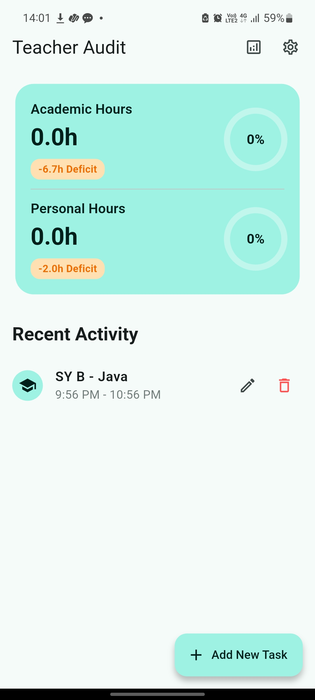
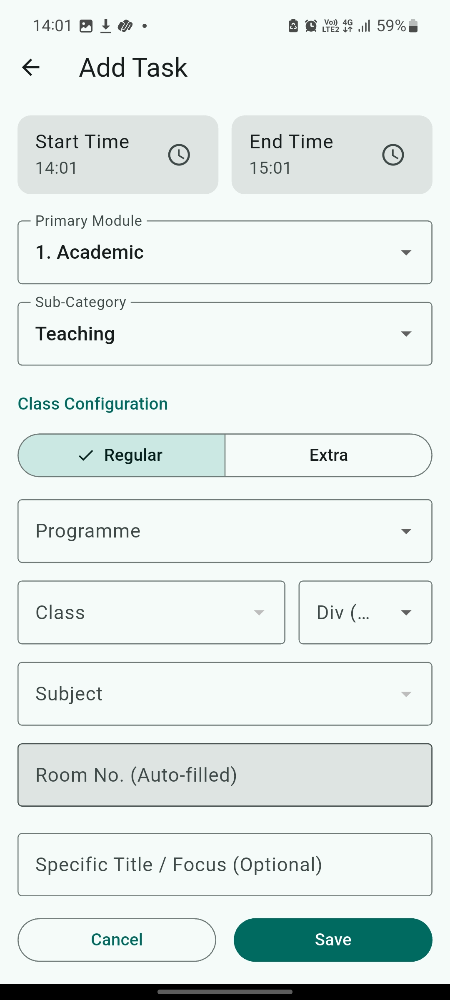
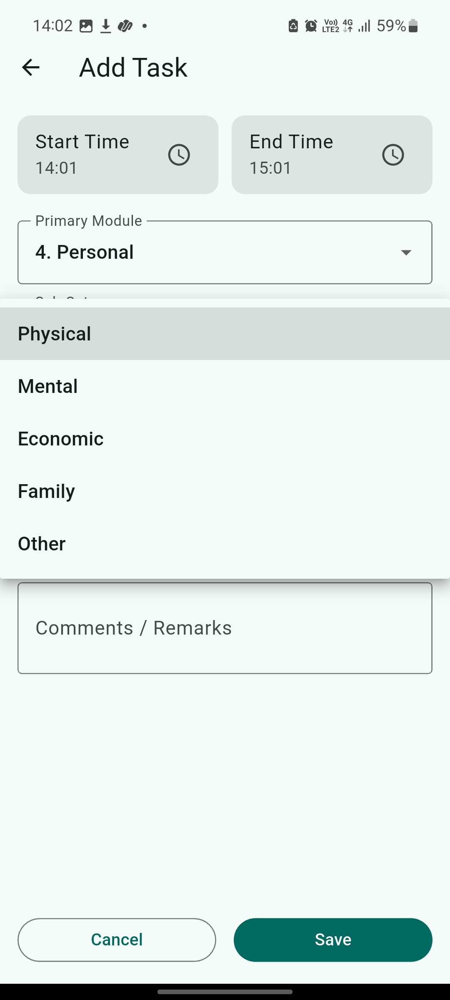
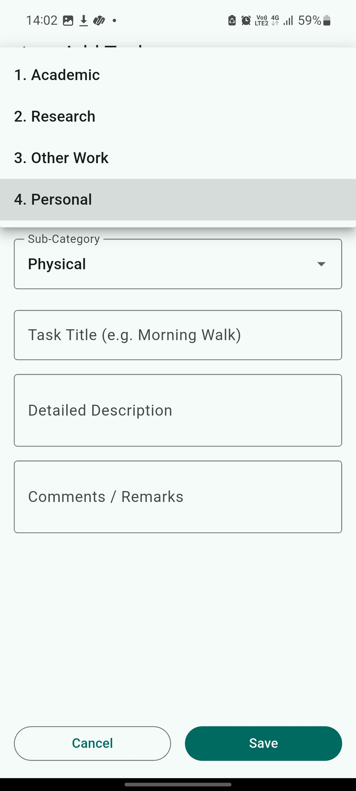
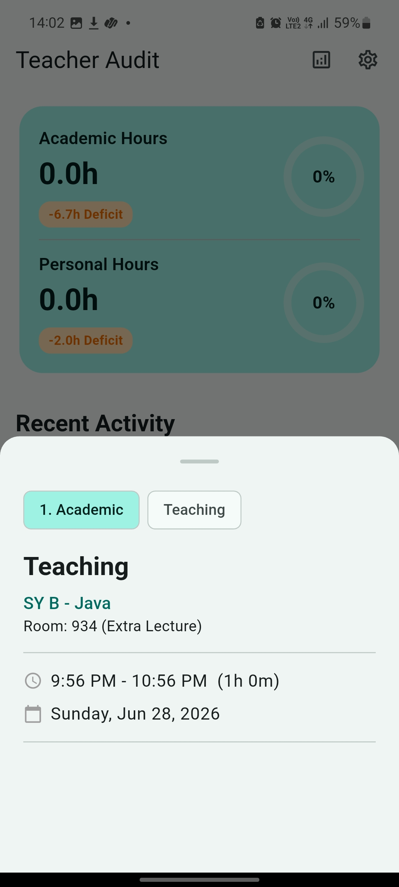
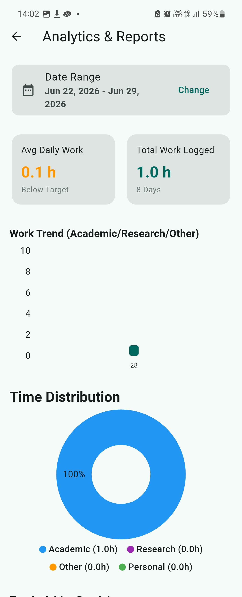
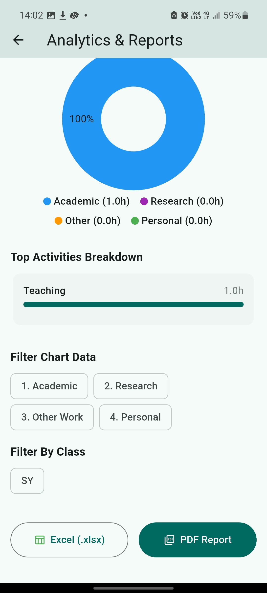
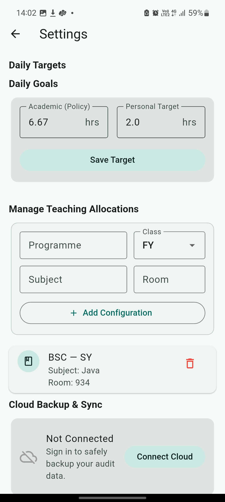
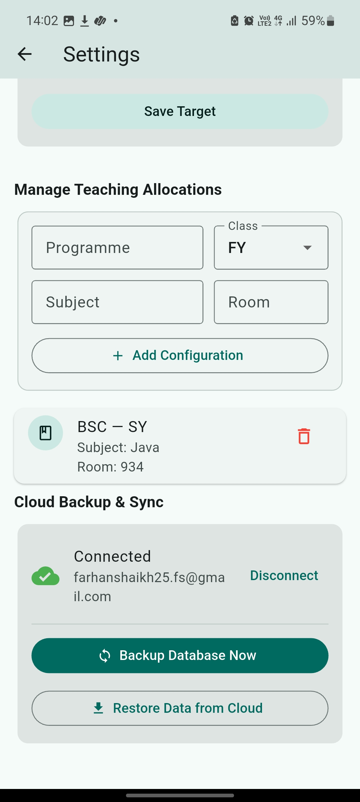

# Teacher Audit 📋

A Flutter-based time tracking and audit app built specifically for teachers — helping them log, categorize, and analyze their academic and personal work hours with offline-first storage and optional cloud sync.

---

## Screenshots

<!-- Dashboard -->




<!-- Add Task - Teaching Form -->


<!-- Add Task - Primary Module Dropdown -->


<!-- Add Task - Sub Category -->


<!-- Add Task - Personal Module -->


<!-- Settings - Daily Targets & Cloud -->


<!-- Settings - Connected State -->


<!-- Analytics & Reports -->


---

## Features

### 🏠 Dashboard
- At-a-glance view of **Academic Hours** and **Personal Hours** logged for the day
- Visual progress rings showing percentage completion toward daily targets
- Deficit indicators showing how many hours are remaining
- **Recent Activity** feed showing the latest logged tasks

### ➕ Add Task
- Log tasks with **Start Time** and **End Time**
- Categorize under **Primary Modules**: Academic, Research, Other Work, Personal
- **Sub-categories** dynamically change based on the selected module
- For Academic > Teaching: select Programme, Class, Division, Subject — with **Room No. auto-filled** based on saved configuration
- Supports Regular and Extra lecture types
- Optional Task Title, Detailed Description, and Comments/Remarks fields

### 📊 Analytics & Reports
- **Date Range** selector for custom period analysis
- Summary cards: Avg Daily Work and Total Work Logged
- **Work Trend** bar chart (Academic / Research / Other)
- **Time Distribution** donut chart broken down by module
- **Top Activities Breakdown** with progress bars
- Filter chart data by module and by class
- Export reports as **Excel (.xlsx)** or **PDF**

### ⚙️ Settings
- Set **Daily Targets** for Academic (Policy) and Personal hours
- **Manage Teaching Allocations** — configure Programme, Class, Subject, and Room for quick auto-fill when logging teaching tasks
- **Cloud Backup & Sync** via Google Drive API — connect your Google account to backup and restore your audit data across devices

---

## Tech Stack

| Layer | Technology |
|---|---|
| Framework | Flutter (Dart) |
| Local Database | SQLite |
| Cloud Sync | Google Drive API |
| Authentication | Google Auth |
| Export | Excel (.xlsx) & PDF generation |
| Platform | Android & Windows |

---

## Getting Started

### Prerequisites
- Flutter SDK installed
- Android device / emulator or Windows machine
- A Google account (for cloud sync — optional)

### Setup

```bash
# Clone the repo
git clone https://github.com/Farhan-Shaikh-25/TeacherAudit.git

# Navigate to project
cd TeacherAudit

# Install dependencies
flutter pub get

# Run the app
flutter run
```

### Cloud Sync Setup
1. Go to **Settings → Cloud Backup & Sync**
2. Tap **Connect Cloud**
3. Sign in with your Google account
4. Use **Backup Database Now** to save data to Drive
5. Use **Restore Data from Cloud** to sync across devices

---

## Project Structure

```
lib/
├── main.dart
├── screens/
│   ├── dashboard_screen.dart
│   ├── analytics_screen.dart
│   ├── settings_screen.dart
│   ├── task_form_screen.dart
│   └── on_boarding_screen.dart
└── utils/
    ├── cloud_sync_provider.dart
    ├── database_helper.dart
    ├── export_helper.dart
    ├── google_auth_client.dart
    ├── task_entry.dart
    ├── task_form_provider.dart
    ├── task_provider.dart
    ├── task_repository.dart
    ├── teaching_subject.dart
    └── user_profile_provider.dart
```

---

## Key Design Decisions

- **Offline-first** — all data stored locally in SQLite, no internet required for core functionality
- **Cross-device sync** — Google Drive API used for optional backup, data follows the user across Android and Windows
- **Dynamic forms** — form fields adapt based on selected module and sub-category, reducing input friction
- **Auto-fill** — room numbers auto-populate based on pre-configured teaching allocations

---

## Author

**Mohammed Farhan Shaikh**
- Portfolio: [portfolio-farhan-25.vercel.app](https://portfolio-farhan-25.vercel.app)
- GitHub: [@Farhan-Shaikh-25](https://github.com/Farhan-Shaikh-25)
- LinkedIn: [mohammed-farhan-shaikh25](https://www.linkedin.com/in/mohammed-farhan-shaikh25)
